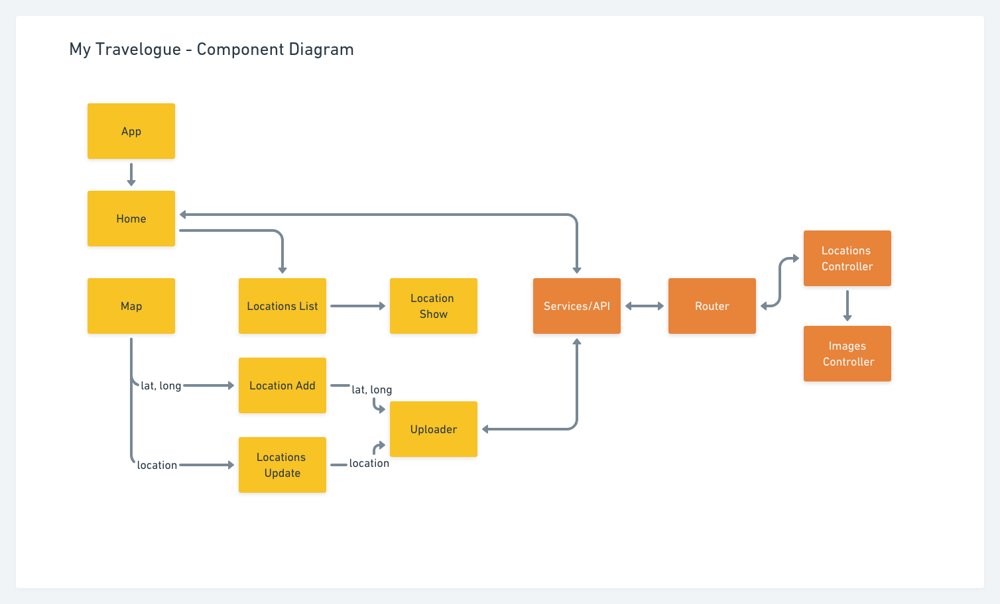
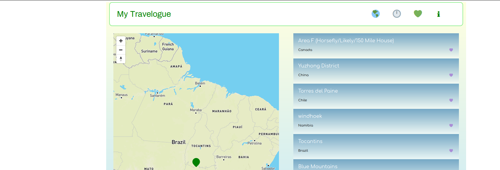

***Mick Roth***


## &#9992; My Travelogue

   Scaled is a recipe calculator that allows users to calculate a ```nutrition facts``` label based on given ingredients. Natural language processing is available, for e.g., '1/2 cup strawberries.' The app uses the free tier of the nutritionix API. Unfortunately this limits calls to 200/day, including undefined returns but is sufficient to showcase the functionality. Also users can save recipes that when retrieved do not make an api call. 
 


#### &#x1F682; Technologies	
- React
- React Router
- React Dropzone
- Mapbox React GL
- OpenCage GeoData API
- Sass
- Sequelize
- Node 
- Express
- Postgres

<br>

#### &#x1F68D; Component Diagram

  




### &#128673; Api
- [Mapbox](https://docs.mapbox.com/api/overview/)
- [OpenCageData](https://opencagedata.com/api)


<br>

### &#127758; Deployed
- [Current Site on Netlify](https://my-travels.netlify.app/)


<br>

<br>
##### Screenshot


<br>
